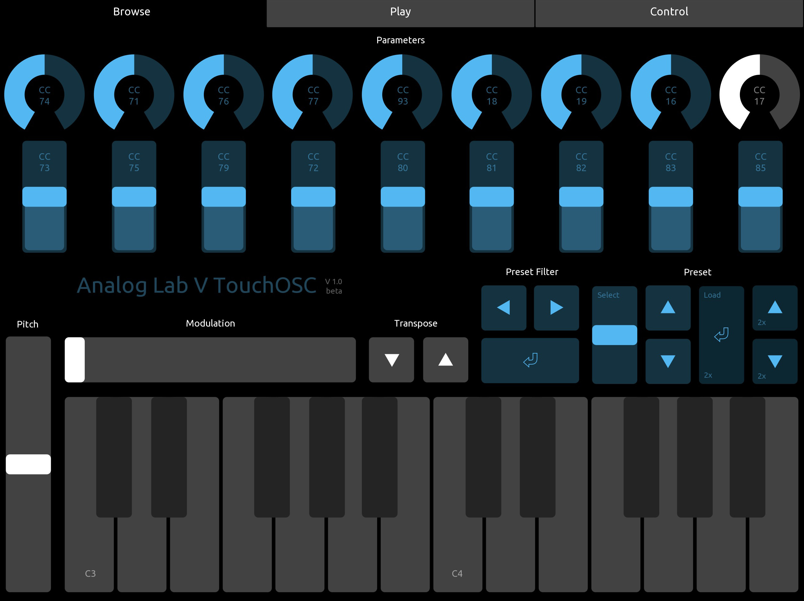

# Analog Lab V TouchOSC
 
Are you tired of browsing tons of Analog Lab V presets with mouse or knobs on your midi controller? Here is the solution: use your tablet to control the Analog Lab V software synthesizer remotely.

This TouchOSC control surface provides a virutal keyboard for playing notes, buttons for selecting/loading presets and 18 knobs/faders to control parameters. Three screens prioritize different use cases ...

### See it in action
[https://www.youtube.com/watch?v=Fj0vL6tI1dE](https://www.youtube.com/watch?v=Fj0vL6tI1dE)

## Instructions
1. Get your TouchOSC working so a TouchOSC Bridge / TouchOSC Midi port is available on your computer.
2. Use this port in your Analog Lab V audio Midi settings.
3. Load the .tosc-file into TouchOSC.
4. Import the .labmidi-file midi controller config into Analog Lab V.
5. Select "Analog Lab V TouchOSC" as midi config in Analog Lab V.

## Notes
Loading a preset needs a double tap. That's why you find these darker blue buttons "2x" labeled. 
    
The control surface is made for an iPad - that's why it's 4:3 and not 16:9.

## Issues
While working on this I noticed serval times, that Analog Lab V no longer reacts on the "Select Preset" control midi message. I found out that changing the control behaviour from absolute to relative fixed this issue. So if this happens to you, go to Settings > MIDI (in Analog Lab V), select "CC 111 Select Preset", right click and change it to relative. 

## License
This is open-sourced software licensed under the MIT license.